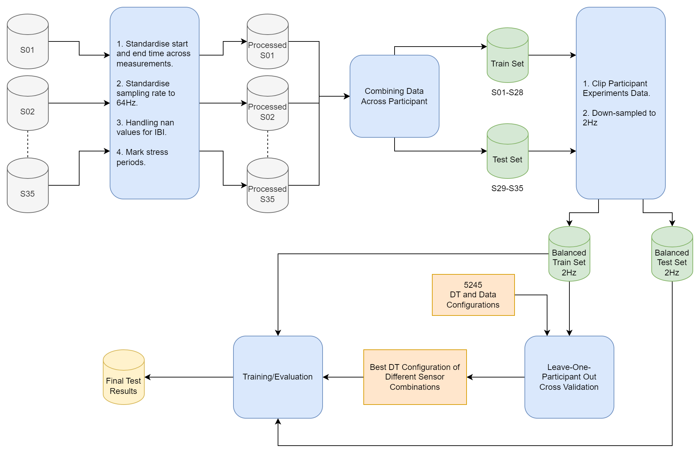
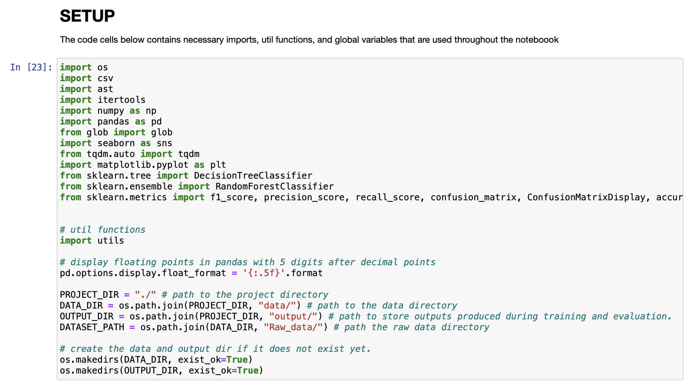

# Analysis of EmpaticaE4 Sensors for Stress Detection
This repo contains an experiment that analyses the potential of use of EmpaticaE4 signals for stress detection by training and evaluating the F1 score of a Decision Tree (DT) classifier on the Stress-Predict dataset [6] using different sensor combinations. It demonstrates that biological signals from IBI and HR play an important role in detecting stress. More specifically, the result shows that an individual's average heart rate ($\mu_{hr}$), heart rate standard deviation ($\sigma_{hr}$), and heart rate variability ($hrv$) [1] are significant factors in the model's decision. Furthermore, the result also shows that the window size for feature extraction of time series data affects the classifier's performance. In particular, increasing window size improves the classifier's performance as the model is trained on aggregated data with more information. These findings serve as the basis for developing a stress detector for wearable devices.

<figure>
  
  <div style="display:flex; align-items:center; justify-content: center;"><figcaption><b>Figure 1</b>: Experiment Process</figcaption></div>
</figure>

# Table of Content
1. [Requirements](#1-requirements)
2. [Project Structure](#2-project-structure)
3. [How to run](#3-how-to-run)
    
    3.1. [Re-run experiment](#31-re-run-experiments)
    
    3.2. [Inference](#32-inference)
4. [References](#4-references)

# 1. Requirements
This project is developed using Python version 3.8.5. It relies on the following third party libraries (also listed in `requirements.txt`):

```shell
tqdm===4.65.0          # graphical progress bars.
pandas===1.5.3         # read/write/manipulate tabular data.
jupyter===1.0.0        # combining python codes with markdown explanations.
seaborn===0.12.2       # creating nice looking graphs
matplotlib===3.7.1     # used by seaborn as backend visualisation engine.
scikit-learn===1.2.2   # developing machine learning models.
```

# 2. Project Structure
```shell
project
│───assets            # Images of graphs and figures.
│───data              # Raw and processed data.
│───output            # Output of experiments.
│   experiment.ipynb  # Jupyter notebook of main experiment.
│   inference.py      # Module for running inference on custom inputs.
│   paper.pdf         # The paper detailing the experiment.
│   README.md         # Project Documenttation.
│   requirements.txt  # Requirements file.
│   utils.py          # Utils functions used in `experiments.ipynb`.
```

# 3. How to run
It is recommended to create a virtual environment using conda, virtualenv, etc before going through the following instructions.

## 3.1. Re-run experiments
This section outlines instructions for re-runing the experiment.

1. Make sure you are in project directory.
```shell
pwd
# ce888-data-science-and-decision-making/project
```

2. Install the needed third parties packages:
```shell
pip install -r requirements.txt
```

3. Download [Raw_data.zip](https://drive.google.com/file/d/1LE89wFp0jufWcDYYh29l1y1zldOdDbk6/view?usp=share_link) and extract it to `project/data/`. This is a modified version of the original data introduced in [italha-d/Stress-Predict-Dataset](https://github.com/italha-d/Stress-Predict-Dataset). In particular, it fixes the error in [task_S27_tags.csv](https://github.com/italha-d/Stress-Predict-Dataset/blob/main/Raw_data/S27/tags_S27.csv) of participant S27.

4. Start jupyter notebook server.
```shell
jupyter notebook
```

5. Open up [experiment.ipynb](./experiment.ipynb).
6. In the `SETUP` section of the notebook, edit the `PROJECT_DIR` variable if you place [experiment.ipynb](./experiment.ipynb) in a different directory from the `ce888-data-science-and-decision-making/project`.



## 3.2. Inference
This project provides [inference.py](./inference.py) for running inferences using the trained model from [experiment.ipynb](./experiment.ipynb).

1. Create a csv file containing the following columns: `accel_x`, `accel_y`, `accel_z`, `skin_temp`, `heart_rate`, `blood_volume_pulse`, `eda`, `inter_beat_interval`.

2. Run the following command:
```
python inference.py input model_path --output_dir OUTPUT_DIR
```

```shell
positional arguments:
  input                 path to input csv file.
  model_path            path to saved model folder that contains both the        
                        pickle and json files.

optional arguments:
  -h, --help            show this help message and exit
  --output_dir OUTPUT_DIR
                        path to output directory.
```

# 4. References
[1] Heart rate variability: Standards of measurement, physiological interpretation and clinical use. Task Force of the European Society of Cardiology and the North American Society of Pacing and Electrophysiology. 93(5):1043–1065.

[2] V. Chandra, A. Priyarup, and D. Sethia. Comparative Study of Physiological Signals from Empatica E4 Wristband for Stress Classification. In M. Singh, V. Tyagi, P. K. Gupta, J. Flusser, T.  ̈Oren, and V. R. Sonawane, editors, Advances in Computing and Data Sciences, volume 1441, pages 218–229. Springer International Publishing.

[3] Empatica Support. E4 data - HR.csv explanation.

[4] Empatica Support. E4 data - IBI expected signal.

[5] T. Iqbal, A. Elahi, S. Ganly, W. Wijns, and A. Shahzad. Photoplethysmography-Based Respiratory Rate Estimation Algorithm for Health Monitoring Applications. 42(2):242–252.

[6] T. Iqbal, A. J. Simpkin, D. Roshan, N. Glynn, J. Killilea, J. Walsh, G. Molloy, S. Ganly, H. Ryman, E. Coen, A. Elahi, W. Wijns, and A. Shahzad. Stress Monitoring Using Wearable Sensors: A Pilot Study and Stress-Predict Dataset. 22(21):8135.

[7] S. J. Lupien, B. S. McEwen, M. R. Gunnar, and C. Heim. Effects of stress throughout the lifespan on the brain, behaviour and cognition. 10(6):434–445.

[8] A. S. Nagaraja, N. C. Sadaoui, P. L. Dorniak, S. K. Lutgendorf, and A. K. Sood. SnapShot:Stress and Disease. 23(2):388–388.e1.

[9] P. Schmidt, A. Reiss, R. Duerichen, C. Marberger, and K. Van Laerhoven. Introducing WESAD, a Multimodal Dataset for Wearable Stress and Affect Detection. pages 400–408. ACM.

[10] P. Siirtola and J. R ̈oning. Comparison of Regression and Classification Models for User-Independent and Personal Stress Detection. 20(16):4402.